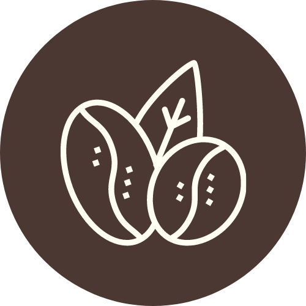
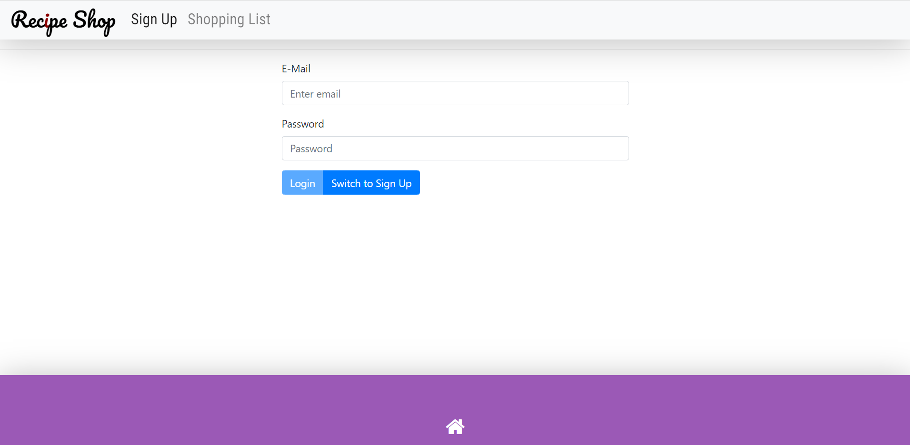
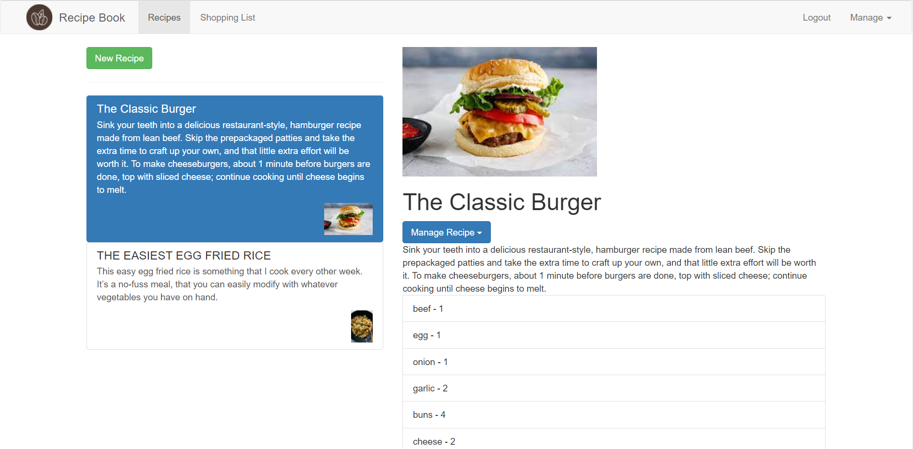
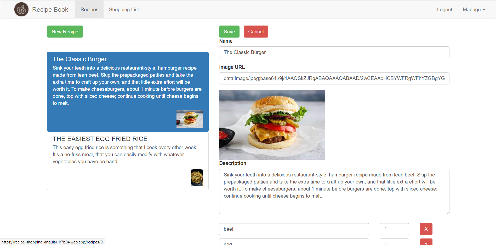
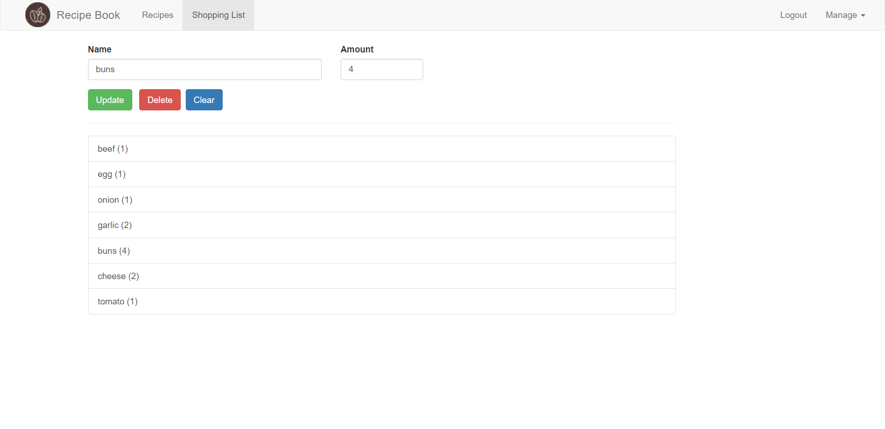

#  Recipe Shop

## [Live Demo](https://youtu.be/u7zg9IBM7uQ)
## What is Recipe Shop?
- A recipe shop application that allow you to add foods as well as its ingredients and then pick ingredients to your bag.
- The main purpose of this project is to practice with Angular ecosystem and some third-party library that very friendly with Angular such as NgRx follow with its best practices.
- Therefore, this application `shouldn't be used for production` because it's created to be quite simple so as for everyone easy to understand the workflow.
You can consider using `Recipe Shop` for produciton if only `you improve it`.

## Technology
- Frontend
  - Angular -  A component-based Framework
  - Angular CLI - Angular Starter Template
  - NgRx/store - State Management
- Backend
  - Firebase - Authentication, Realtime Database.

**Note:** Switch to branch `pure-service` if you want to see this application's states managed by Angular services.

## Some preview images
&nbsp;
&nbsp;

## Available Scripts
Before jump in to run this application:
- First, remember to create a `environment.ts` (development) and `environment.prod.ts` (production) files with content exactly like `environment.example.ts` file content.
- Then replace  `your_api_key` with your  [Firebase](https://firebase.google.com/) API.

In the project directory, you can run:
## Install dependencies
```
yarn
```
you can use `npm install` command instead which is slower.
## Run development server
```
yarn start
```

Will run `ng serve` for a dev server internally. Navigate to `http://localhost:4200/`. The app will automatically reload if you change any of the source files.
## Build

```
yarn build
```

Run `ng build` to build the project. The build artifacts will be stored in the `dist/` directory.

# License & copyright

© Kirin Tran, FPT University TP.HCM
Licensed under the [MIT LICENSE](LICENSE).
